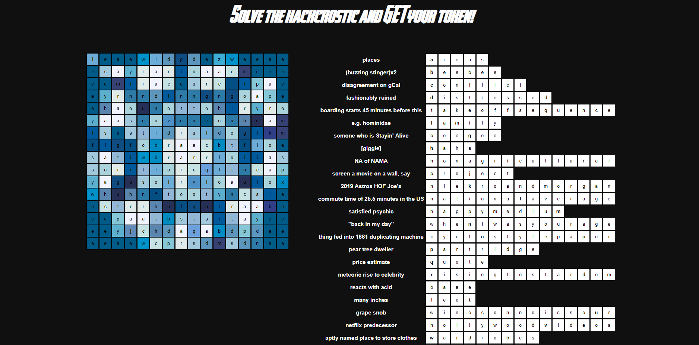

# hackmit-puzzles-2019

Since 2014, HackMIT has released an annual admissions puzzle, similar to an online puzzlehunt that guarantees admission to the first 50 teams that solve them. Each year has a different theme, and this year's theme was the Avengers! 

For the past 3 years, my team has attempted solving them. Here are our results:
- 2017 -- we solved them and made the top 50
- 2018 -- we got stuck on the last puzzle and unfortunately did not make it
- 2019 -- we solved them and made the top 50

No matter the result, the experience is extremely fun and worth the countless hours spent solving them. We applaud the HackMIT organizers for going to such effort to make these puzzles. Despite how frustrating solving them can be at times, we appreciate all of the hard work required to make them. It's an amazing experience.

This year, we decided to do a write-up of our experience and how we solved the puzzles.

## Write Up
### Puzzle 1: Hulk SMASH

Ah. The first puzzle. Felt good to be back at it again. Last year, there was a puzzle that was solved by writing an auto-clicking bot, so we thought that this puzzle might be similar to that. However, after checking the JavaScript, it seemed clear that we could solve this without that. After toying around with the code, we deduced that the JavaScript line ```fillPosition(parseInt(locSpl[0]), parseInt(locSpl[1]), hex);``` would "break down" a pixel of the wall, getting Hulk one step closer to seeing what was behind the wall. What was interesting was that this function was being called several times in a loop, despite the fact that it resided within a single API GET request... why was there a loop? The endpoint ```/u/${username_and_hash}/${x}/${y}``` was supposed to be used to break down a single pixel of the wall at coordinate ```(x, y)```. After logging the response, we learned that a very long list was returned rather than a single coordinate, hence the loop to loop over this list. In fact, the API call returned a list of hex values and coordinates to which those hex values correspond. These hex values represented the actual image behind the wall. And the loop was simply looping over each coordinate/HEX returned and should have been breaking down the wall at all of those coordinates... But somehow not all calls to ```fillPosition``` were resulting in breaking down a pixel of the wall. Only the first call to the function was successful in the loop due to the boolean flag.

Solution: we hacked together a quick script that called the API at a few dispersed coordinates in the image (12 to be exact) and removed the boolean flag. After running it, the wall was broken down :-)

### Puzzle 2: I LOVE IRONMAN

We arrived to this beautiful piece of work. Looks like a website where your computer is instantly hacked, right?

After perusing the website for a bit, we noticed an area at the bottom of the webpage that said "You are not authorized to access this area. Your browser can't handle it." We looked at the HTML and discovered that most of the transcript for IronMan was embedded within a ```<div style="display:none">``` HTML tag. It was completely out of order and contained much duplication. It was effectively impossible to view the script in its entirety, too, because any browser is not built to handle this many nested tags... 

Eventually, we noticed that there was a single character randomly placed in one of the many nested tags. "Duh." The hint all of the sudden made sense:

> "Honestly if we could just untangle the internal workings we can find small bits of information
> Like one character words?"

All of the one character words in the nested tags could be concatenated to produce the solution! We wrote up a quick recursive traversal of the DOM using preorder traversal (thanks Google!) and outputted only lines where a single character existed and concatenated them into a string. The solution magically appeared :-)

### Puzzle 3: Acrostic
Who doesn't love a good crossword? This one was quite fun. A true puzzle. We thought the solution here would be fairly obvious. Fill out the crossword and one obvious word would appear, GET request that endpoint, get our solution, and be done... Turns out finding that one obvious word proved trickier than we thought. The first thing we noticed was that in each of the puzzle answers, there was a single letter that was bolded. After solving a few, we quickly realized that each of these letters would contribute to a vertical alphabet read from top to bottom. That was useful for helping us come up with the correct answers... but eventually we were stuck again. Using Google Chrome's DevTools, we noticed the very conspicuous ```data.js``` file, but we couldn't exactly figure out why it would be useful. We tried many different things to try and make use of this file. We finally discovered that the grid appeared to be roughly symmetric across the vertical axis by letters. We thought a design might be hidden in these letters. We thought to color each letter in the grid with the corresponding data color from the file (i.e. all letter As would be colored with ```clues[0]['data']```, all letter Bs with ```clues[1]['data']```, etc. This finally looked like something...



After a few seconds, we realized it was the arc reactor from Iron Man's suit. Ironically, we had guessed ```arc_reactor``` as an endpoint earlier when we had low morale and resorted to blind guessing. The actual endpoint was ```arcreactor```. I guess it feels good to solve the puzzle correctly... but damn we could have used some of those hours for the other puzzles ¯\\_(ツ)_/¯\

### Puzzle 4: The Infinity Phones

We came to this webpage and did what any normal puzzle solver would do: listen to the recordings.

> "(weird beats lasting for about 2 seconds) Hi is this the Fort Smith Geology Department? Can you help me find one of the Infinity Stones? No. Oh, okay"
> "(weird beats lasting for about 2 seconds) Hi is this the Syracuse Geology Department? Can you help me find one of the Infinity Stones? No. Oh, okay"
> "(weird beats lasting for about 2 seconds) Hi is this the Idaho Geology Department? Can you help me find one of the Infinity Stones? Perfect. Thank you for the clue."

The weird beats at the beginning of each recording were the only thing that sounded useful, so we immediately thought to decode the beats into their musical notes. One of our group members is a Music Major, so he had software to do this already. He gave us the notes for each recording probably within 5 minutes of starting this puzzle. There was a lot of second guessing as to whether this was the right strategy, if we needed to decode the tones into DTMF (Dual-Tone Multi-Frequency) and then into dial tones, if we needed to analyze the spectrograms, and what did Idaho have to do with anything? Why was Idaho the clue?

We all agreed that the recordings needed to be translated into phone numbers since each recording was exactly 10 musical notes, but we weren't sure how the phone numbers would be used or how to translate the recordings into phone numbers. We finally noticed that each of the locations had a distinct zip code (yes the whole state of Idaho is 208 -- three of our group members our from there) and these three zip codes shared no common digits. Each of the first three notes of the recordings were completely unique from each other as well. We had finally discovered our cipher :-) Each distinct note corresponded to a digit of the area code. We wrote up a quick script to do the decryption and had our phone numbers... but what to do with them?

We tried using an online T9 simulator to see if the phone numbers would be translated into text. Eventually, we thought we may as well call the phone numbers. There was no way they actually set something up to where we'd have to call somebody, right? Wrong. We called the number, and an automated response told us, "GET request 'museum' to get your clue to the location of the next infinity stone." Puzzle solved :-)

### Puzzle 5: Shards Puzzle
This was a puzzle in the most accurate sense of the word. We were presented with 760 50x200 images in random order. Our job: piece the images back together to form the original image. Some puzzlers apparently printed out all of the images, cut them out, and then actually solved it like a normal puzzle. We like computer science, so we implemented a puzzle solving algorithm. The idea was fairly simple, but took much care to get right. Our algorithm from a high-level viewpoint looked something like this:

```
for each shard:
  compute the most likely top, bottom, left, and right neighbors of the shard
  chunk together the two most promising candidates
```
Check out the [code](puzzle-5/shards.py) for some of the nitty gritty details.

The final stiched image looked like:


Pretty good, eh?

### Puzzle 6: Training/Test Set Partition
This puzzle was quite a fun challenge. The puzzle:


Further down on the page, the researchers listed the stats of the neural network that was used. So essentially, our task was to reverse engineer a neural net by determining which inputs were from the training set (e.g. the set that produced the model in the first place) and which inputs were from the test set. For every input (a base 64 image string from the CIFAR-100 dataset), we were given an object ID, the base-64 image string, and a prediction vector (i.e. a vector where the index is the predicted class and the value is the model's predicted probability of the input being from that class). Based on this, we were to determine whether an image helped create the neural net. Not much to go off of... But the journey to HackMIT is never an easy one.

Challenge #1 was simply scraping the data from the website. The only available API GET request took approximately 2.3 seconds to retrieve a single data point. We needed 1,000 data points at the very minimum to submit (around 40 minutes of work), but realistically, much more data than that in order to search for a pattern. This would have been extremely slow to acquire data this way, so we wrote a [parallelized scraper](puzzle-6/parallel_scraper.py) to get data at a much faster rate.

Onto solving the puzzle... our first idea was that perhaps they overfitted their model. In this case, all training data points would have an extremely high prediction probability (e.g. a probability of 1 for a single class). However, filtering to just a list of 1000 of these data points and submitting these object IDs gave us the following message:
> Accuracy between 70% and 85%

We needed an accuracy of 85% or higher. Since the dataset was a public dataset [(the CIFAR 100 dataset)](https://www.cs.toronto.edu/~kriz/cifar.html), we thought perhaps the puzzle was really simple. If the data point was from the CIFAR 100 training data set, then it was probably from the researchers' training data set, too, right? Wrong.
> Accuracy between 70% and 85%

Next idea: what about filtering to images that were predicted correctly? After all, the dataset was public, so we could simply compare the predicted labels to the actual labels.
> Accuracy between 70% and 85%

What about the combination (i.e. high prediction probability AND correct prediction)?
> Accuracy between 70% and 85%

What about filtering to data with lower prediction probabilities or within some arbitrary range?
> Accuracy between 70% and 85%
or
> Accuracy between 55% and 70%
or
> Accuracy below 50%

This puzzle was hard. Finally we came up with an idea that we knew would work. We were going to produce a contrived solution set that would report either "Accuracy below 50%" or "Accuracy between 55% and 70%" by changing only a single object ID in the set. If the accuracy improved by adding this one item, we knew it had to be a part of the original training data set, and so we then would add it to our actual final submission set. Creating that contrived solution set was non-trivial, but involved using an algorithm similar to binary search. Another consideration with this approach was that we were only allowed to submit a potential solution every 5 minutes... so this would have taken forever to get 1000 correct object IDs. However, we realized that we could bypass this by submitting our requests from a randomly hashed URL. We further increased the speed by parallelizing our program. Sorry to whoever was trying to use the website at this time ¯\\_(ツ)_/¯ Did we mention that our parallel scraper was still running? Oops.

While this code was running, we went to Safeway to purchase some ice cream. It was 1 AM. Fun times. We came back, submitted our solution set, and finished the puzzles! 🎉
